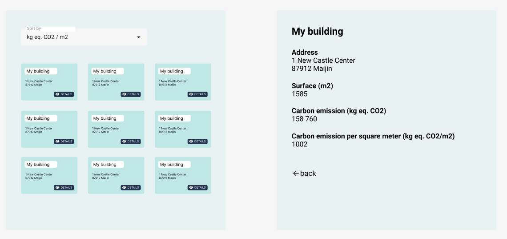

# Frontend coding test

  

We invite you to create an application that allows visualizing all the buildings currently under construction at the national level.

  

## What we expect from you

  

- For this test, you can use the front-end technology (language + framework if applicable) of your choice.

- You can allocate a maximum of 1 hour and 30 minutes.

- Write your code as if you were in a real-world situation, making sure to create robust and maintainable code.

- This test serves as a basis for a discussion, and the methods employed are more important than the result.

- Since this test can be a bit lengthy, the goal is not to complete all the levels but to focus on the code structure and implementation quality.

- If you have any questions, feel free to send us a message to request clarification or explanations.

- When you're finished, you can share your repository on Github or Gitlab with np@vizcab.io and bp@vizcab.io.

- Please also provide us with a list of improvements you would have liked to make to your application but may not have had the time to implement.

  

## Objectives

  

- [x] Create a web interface displaying the list of buildings under construction.

- [x] Clicking on a building in the list will take you to a page that presents its characteristics.

- [x] Add an input for sorting buildings either by carbon emission per square meter or by building surface.

  

### Bonus

  

- [x] Write tests to ensure the reliability of the application.

- [x] Add a pagination system to display buildings in batches of 10 on the same page.

- [x] Save sorting option in localStorage

  

## How to Get Started

  

- Clone the repository.

- Start the backend (see README), which will provide you with the API containing the list of buildings.

- Create the frontend application!

  

## Mockup

  

For reference, you can use this mockup to develop your application:

  

